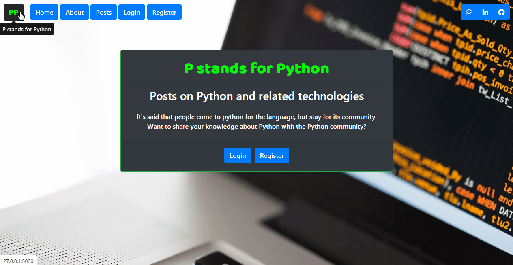
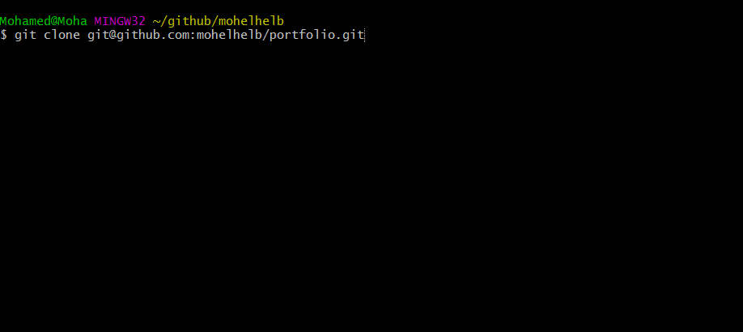

## Blog Application

Simple blog-based application built with Flask (Python web framework)

### Description
It allows users to register for a new account,
sign in, sign out, and cancel their accounts. It is also CRUD
compliant, that is to say it is a model that provides four basic
types of functionality: *Create*, *Read*, *Update*, and *Delete* posts.
Despite the fact that it is not a large application, *user authentication* and
*user experience* have been carefully taken into account.

### Video Presentation

### Technologies

- Programming Language: Python 3.7.x

- Web Framework: Flask 1.1.x

- CSS Framework: Bootstrap 4.3.x

- Dependencies: *Please see the requirements file.*

### Setup

### Project Status
This project is in progress. There are a few features that are to
be allowed for, namely password recovery, change of credentials,
software deployment, etc.

### Inspiration
This application is based on Mr. Traversy's inspirational [video tutorials on Flask](https://www.youtube.com/watch?v=zRwy8gtgJ1A) (@bradtraversy).
